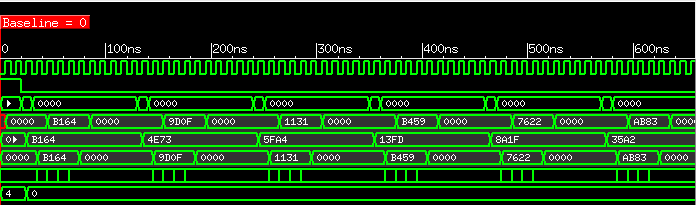
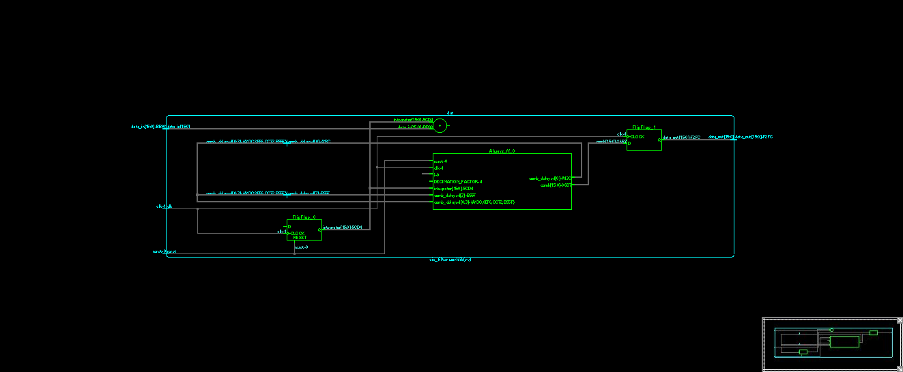
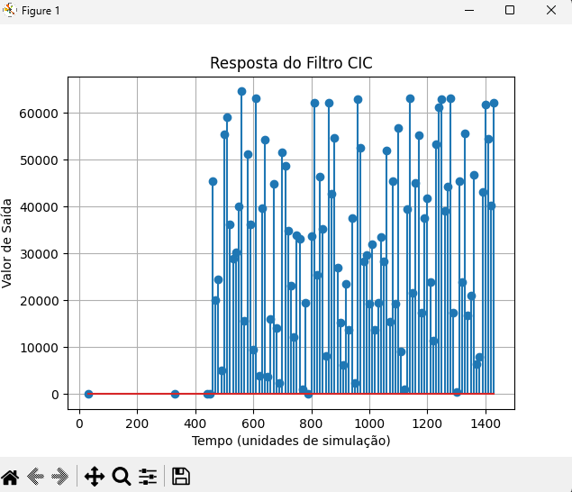

# Filtros CIC.

## Índice
- [Especificações](#Especificações)
- [Recursos](#Recursos)
- [Simulação](#Simulação)
- [Autor](#Autor)
- [Licença](#Licença)

## Especificações:

```
Design de um Filtro CIC implementado em SystemVerilog com testbench de verificação e simulação obtendo resposta temporal (ao impulso e a uma entrada arbitrária) e resposta em frequência. E utilização de python para gerar o sinal, obter a resposta e plotar em um gráfico.
```

### Recursos:

```
Licença Cadence/Xcelium.

Licença Cadence/Simvision.

Python 3.10.

Bibliotecas Python: Matplotlib e Numpy.
```

## Simulação

Para iniciar a simulação utilize o comando make.

```
make
```

Após iniciar a simulação uma janela do Simvision e um gráfico em python serão abertos.

Visualização das ondas.



Visualização do RTL.



Visualização do Gráfico.



## Autor

* **André Medeiros** - [André Medeiros](https://github.com/andreemedeiros)

Contribuição no projeto [Filtros_CIC](https://github.com/andreemedeiros/Filtros_CIC/graphs/contributors).

## Licença

Este projeto está licenciado sob a MIT License - veja a [LICENSE.md](LICENSE.md) para mais detalhes.
